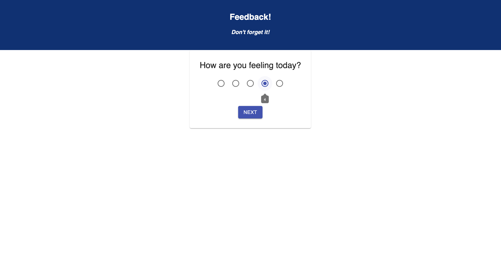
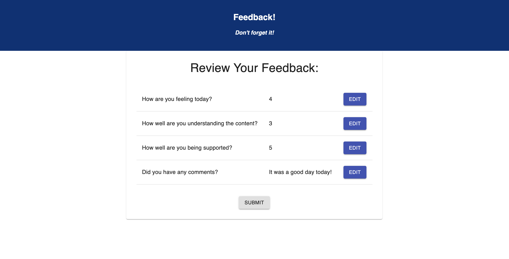
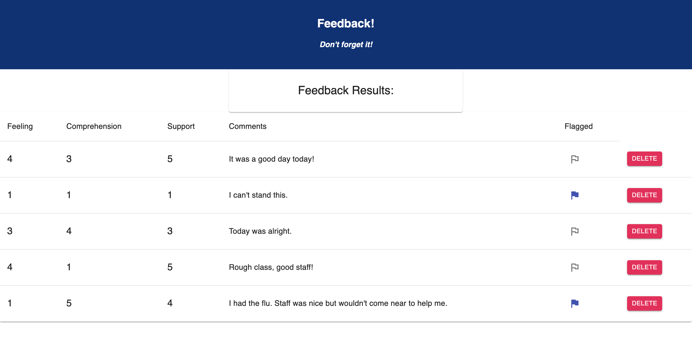

# Redux Daily Feedback

## Description

_Duration: Weekend Challenge_

This app submits a student's daily feedback. Through four views it collects how the user felt today, how well the user understood the material, how well the staff supported the user, and any comments the user had about today. Then a review view is presented that displays the user's feedback for today with links to return to previous views to edit the user's feedback. A submit button on the review view inserts a new feedback entry to the database.

## Screen Shot

### Prerequisites

- [Node.js](https://nodejs.org/en/)

## Installation

1. Create database `prime_feedback`
2. View the queries in data.sql. Create the table `feedback` by running the second query
3. Open up the terminal of choice, navigate to this directory and run `npm install`
4. Run `npm run server` in your terminal
5. Run `npm run client` in your terminal
6. The `npm run client` command will open up a new browser tab with the app running

## Usage

1. Give Feedback by selecting one of the 1-5 dots
2. Advance views with the `NEXT` button
3. Leave Comments in the text area
4. Review your Feedback
5. Edit your Feedback by navigating with the `EDIT` buttons
6. Submit your feedback from the Review screen
7. Begin another feedback entry with the `NEW FEEDBACK` button

## Admin Usage

1. Navigate to the admin screen at `/admin`
1. Flag an entry for review with the flag button
1. Delete an entry with the `DELETE` button

## Built With

[React](https://reactjs.org/)
[Redux](https://redux.js.org/)
[Material-UI](https://material-ui.com/)
[Framer-Motion](https://www.framer.com/motion/)

## License

[MIT](LICENSE.TXT)

## Acknowledgement

Thanks to [Prime Digital Academy](www.primeacademy.io) who equipped and helped me to make this application a reality.

## Support

If you have suggestions or issues, please email me at [ccheltonap@gmail.com](mailto:ccheltonap@gmail.com)
